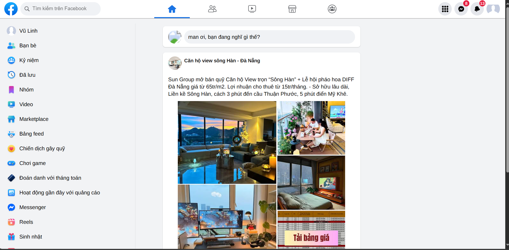
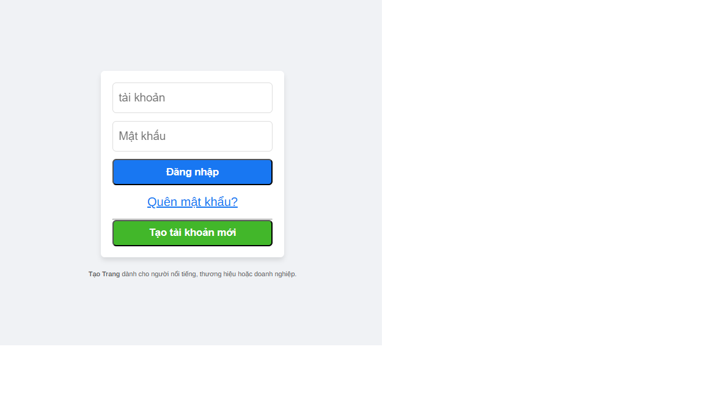
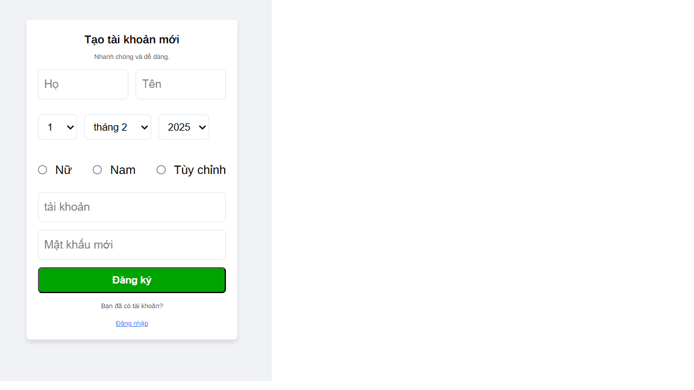

# FBL - Social Media Platform 🚀

[](https://react.dev/)
[](https://nodejs.org/)
[](https://www.mongodb.com/)

A lightweight social media application inspired by Facebook, featuring core functionalities like user authentication, post sharing, and real-time interactions.

**GitHub Repo**: [https://github.com/unknow-cpu/fbl](https://github.com/unknow-cpu/fbl)



<!-- Thêm ảnh demo tại đây -->

## ✨ Features
- **User Authentication**: Login/Register with JWT & OAuth (Google/Facebook).
- **Post Management**: Create, edit, delete posts with text/images.
- **Real-time Chat**: Instant messaging using Socket.io.
- **Friend System**: Send/accept friend requests, view friends list.
- **Notifications**: Real-time updates for likes, comments, and messages.
- **Responsive Design**: Optimized for mobile and desktop.
- Session management with cookies
- Fetch user profiles
- Error handling for common authentication issues
- MongoDB database integration
- Modular API structure

## 🛠️ Technologies
- **Frontend**: React.js, Redux Toolkit, Tailwind CSS, Socket.io Client
- **Backend**: Node.js, Express.js, RESTful API
- **Database**: MongoDB (Mongoose ODM)
- **Real-time**: Socket.io
- **Authentication**: JWT, Passport.js
- **Deployment**: Docker, Nginx (tùy chọn)

## 🚀 Installation
1. **Clone the repository**:
   ```bash
   git clone https://github.com/unknow-cpu/fbl.git
   cd fbl
2. Install dependencies:
   ```bash
   npm install
3. Create a .env file and configure the following variables:
   ```bash
   PORT=5000
   MONGODB_URI=<Your_MongoDB_URI>
   SESSION_SECRET=<Your_Session_Secret>
4.Run the server:
      ```bash
   npm start.

5.The API will be available at http://localhost:5000.
PI Endpoints

Authentication

POST /api/login: Authenticate user credentials.

POST /api/logout: Log the user out and destroy the session.

GET /api/check-session: Verify if the user is authenticated.

User Profile

GET /profile: Retrieve the authenticated user's profile.

Contributing

Feel free to fork this project and submit pull requests. Ensure that you test thoroughly before contributing.

License

This project is licensed under the MIT License.
